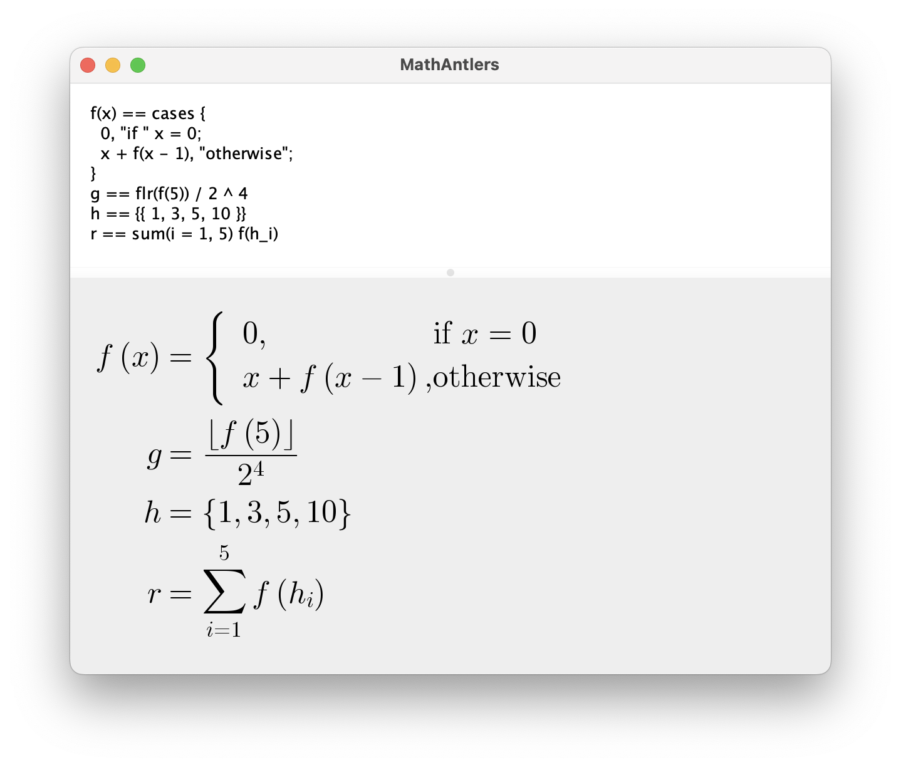

# MathAntlers

MathAntlers is a simple Java application that converts a custom, simplified syntax into LaTeX mathematics.

The generated LaTeX markup, or a rendered image, can be copied.

## Licensing

Copyright Prince Zyntaks (furrz).

Licensed under the MIT license. See LICENSE for full license text.

Powered by Java, ANTLR v4, and scilab JLaTeXMath.
- [ANTLR v4 License](https://www.antlr.org/license.html)
- [JLaTeXMath License](https://github.com/opencollab/jlatexmath/blob/master/LICENSE).
